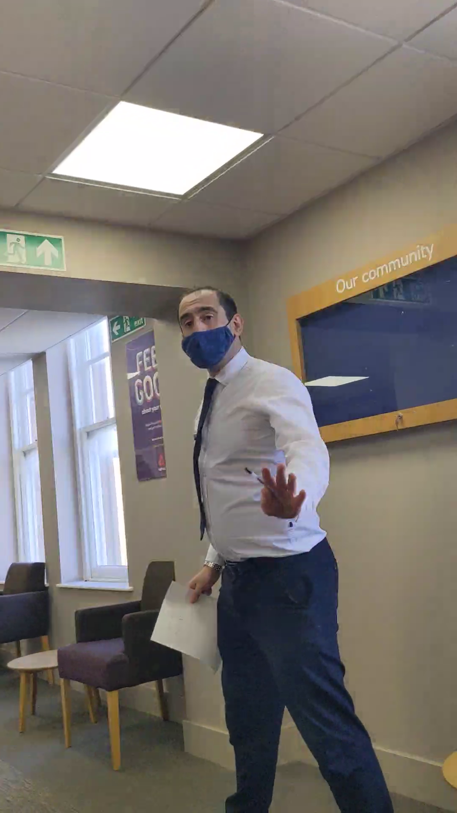
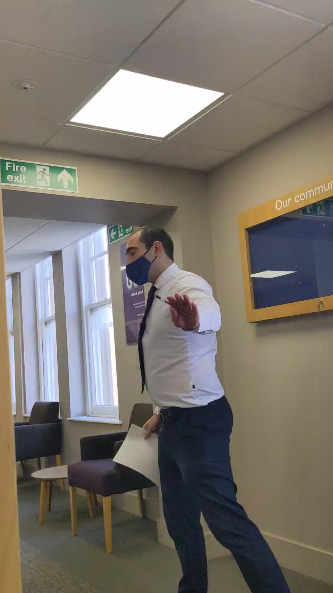
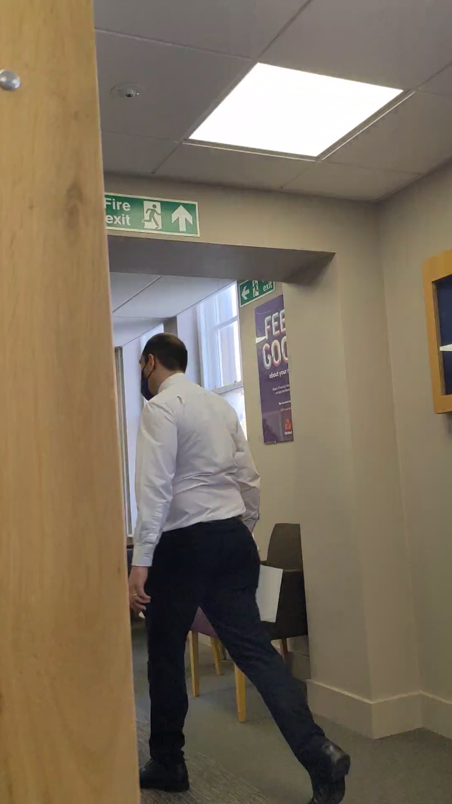
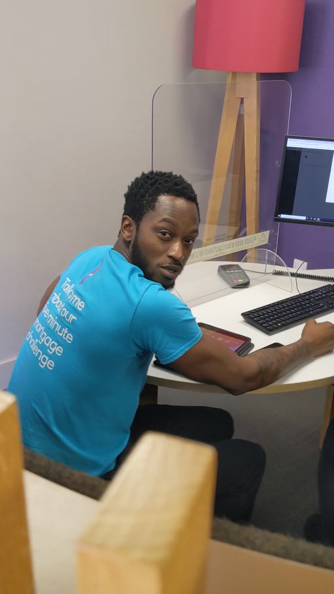

# NatWest

```text
     Node: NatWest
     Type: Babylon (financial)
     Date: Tuesday 21 September 2021, 08:59:56 UTC
 Location: NatWest, Brixton branch (next to Art's flat)
  Summary: Lifelong customer denied his own money. Bank calls 999
           after he's already gone home. Police arrive in 5 minutes.
```

> Four days out of HMP Edinburgh after 10 days on remand for false charges laid
> by corrupt pigs on orders from a psychopathic gangster princess who thinks
> she's a queen but behaves like a rabid toddler. She was angry after Art
> refused to kneel and escaped from Edinburgh to his ancestral home in Sterling.
> Later, she made an attempt on his life, but that's a whole other story.
> She's not the first woman to try this. Art hopes she's the last.

## 1. The Refusal

Wallet lost or stolen by Feds Scotæ. Passport for ID. Art walked into the
NatWest branch opposite his flat and asked for some cash.

The amount exceeded whatever limit makes a counter clerk nervous, so he had to
see the manager. Art was still mostly lower mind — raw, no persona layer, no
customer-service smile. He sat down with the manager.

The manager looked at a man fresh out of gaol, unmasked, operating without a
filter, and felt something he did not like. He, being a Big Man of Babylon, then
attempted to repair his fragile ego by asserting dominance with the dickslap
manoeuvre (denying Art his own cash) - the dickslap failed because he lacked the
necessary biological hardware.

Art showed the barest hint of a tooth in response and the manager shat himself,
then ran off to hide in his office, in his own filth, shaking and crying (Art
presumes). Art made no threat, but the mask was off, and without it the bitch
ass pussy ass manager saw the Real™ him, and realised that his dickless dickslap
had provoked anger.

The manager's threat assessment was `capability + anger == kinetics` - an
obvious logic error. Art knows that he was terrified, but that's on him - *u fuk
wit da bull, u get da hornz*. He didn't even get the hornz. Art showed the tip
of a tooth and called him an arsehole. Art was being soft because he didn't want
to terrify the man, but the man terrified himself. Art's fault? Maybe a little,
but he had just spent 10 days locked up with the animals, and his threat
response was out of whack.

A lifelong customer was refused access to his own account, with valid
government-issued ID, at the branch next to his home.

Art pulled out his phone and started recording.

<video src="PXL_20210921_085956653.mp4" controls></video>

**Transcript** (21 seconds, recorded on Art's phone):

> **[00:00] Art to Manager** So you're saying you're not gonna let me take my
> money out of my bank, are you? Wow, you really are an arsehole.
>
> **[00:07] Art to Staff** Ah... Excuse me. Are any of you guys gonna let me
> take my money out? Cuz this guy... if you hear that. I have not been
> aggressive. I've done nothing. I just want my money. You gonna help me?
>
> **[00:12] Fake Rude Bwoy to Art** [Unintelligible].
>
> **[00:15] Art to Staff** So the manager is [half laugh] not letting me take
> the money out and you guys agree with that?
>
> **[00:17] Fake Rude Bwoy to Art** Are you filming me?
>
> **[00:19] Art to Fake Rude Bwoy** Of course I am.
>
> **[00:19] Art to Staff** Right, I'll see you guys.

**Stills:**

| [00:01] The Manager | [00:02] Fleeing |
| :---: | :---: |
|  |  |
| **[00:02] Gone** | **[00:16] The Fake Rude Bwoy** |
|  |  |

**Tone:** Note the switch. The first line is spoken with anger — addressed to
the manager, who deserves it. From [00:07] the anger is gone. Art is speaking to
the other staff calmly, clearly, making a record. He is 100% in control. He
explicitly states on camera that he has not been aggressive. None of the staff
engage with his point — they know the boss will review CCTV later and they are
not going to be caught agreeing with the customer.

The one staff member who does speak asks "are you filming me?" in a bone parody
of rude bwoy tone, to which Art now replies:

> ur not street blud, ur a bitch 4 babylon. bet u got robbed sumin chronix as a
> yoot. u a pussyhole, a bare dutty pum pum. u know where i live. bet u don cum
> visit.

At no point does he raise his voice to a shout, make a threat, or move toward
anyone. He leaves under his own steam.

The video is 21 seconds long. A man asking for his own money. The first line is
addressed to the manager, who is standing facing him. The rest is addressed to
other staff — because the manager has run off. Note that the manager is in
motion at the start of the video, Art is seated. That is the entire incident.

On his way out Art stopped and talked to a woman (tall/black/hot) working
downstairs. She couldn't verbally agree that her boss is a **pussyhole**. But
she knows it, and Art knows she knows it. She also knows that both her boss and
Art fancy her. They chatted for a minute or two. She was not threatened — she is
a Real™ woman so she can tell the difference between anger and threat. This
conversation is evidence. She needs to be identified. Art's interest is
evidential. Also, he is currently unattached. Should she wish to discuss the
matter further, his door is the black one next to Refill, top bell.

He left the bank. Went home. Started making breakfast.

## 2. The False Report

After Art had left — gone, departed, no longer present. The manager called, or
caused to be called, 999, then, presumably, went home to change his shit stained
clothing.

The Filth were at Art's door five minutes later.

Five minutes. In Brixton. On a Tuesday morning. The call was made, dispatched,
and officers were en route within two minutes. You could get stabbed on
Coldharbour Lane and wait an hour. You could get shot on Angel Town and the
response time would be measured in coffee breaks. But a bank manager whose
oh-so-fragile ego got bruised by a man who wanted his own money? Two minutes to
dispatch. Priority one. Blue lights. A King's ransom in taxpayer-funded rapid
response for a customer who had gone home to make an omelette.

There was no reason for the 999 call. The situation was over. The "threat" was
at home grating cheese. NatWest got a priority response that actual victims of
actual crime in Brixton do not get, for an incident that was not a crime,
involving a man who was not present, because the bank manager has no cock.

### False report liability

NatWest reported a man who had already left the premises. No crime was
committed. No threat was made. Being angry at a bank is not an offence.

Under English law:

- **Wasting police time (Criminal Law Act 1967, s.5(2))** — knowingly causing
  wasteful deployment of police resources. Summary offence, up to 6 months. The
  deployment was objectively wasteful. The man had gone home.
- **Perverting the course of justice (Common Law)** — if (ha!) the 999 call
  contains fabricated or embellished claims about Art's behaviour. Indictable,
  maximum life imprisonment. Art has the video. The pigs have the 999 recording.
  Someone is **fucked**, and it's not Art.

The 999 call recording is requested via [Met SAR](sar-metropolitan-police.eml).
The recording will show what NatWest actually told police. The video shows what
actually happened. The comparison writes itself. NatWest's legal team can
explain the discrepancy to a judge, if they can find one in South London who
hasn't been stabbed while waiting for a police response.

The [NatWest SAR](sar-natwest.eml) will also reveal the notes that were added
to Art's account after the incident. These will be informative.

### The £4k

Soon after the incident Art moved to another bank. He took all his cash plus a
£4k overdraft.

He took the £4k as partial compensation for the refusal of service and the
illegal deployment of street dogs. [Civil action](complaint-natwest.eml) is
pending. He acknowledges that damages sought must be net of this figure. He will
NOT pay interest.

NatWest have sent debt collectors — who are also cockless. They send letters.
They make phone calls. They come to his door and attempt to slap down phantom
dicks. Art finds it hilarious. They may have already taken him to court — he
does not accept Babylon mail; all gets burned.

## 3. Reality Check

```text
INPUT:  Man asks bank for his own money. Bank says no. Man is angry. Man chats
        to hot woman downstairs. Man leaves.
OUTPUT: Manager calls 999 after the man has gone. Priority dispatch. Police at
        his door in 5 minutes. The manager fancied her too. QED.
CHECK:  FAIL
```

The feds are not available to everyone. NatWest gets two minutes to dispatch
because NatWest is Babylon. One branch of calls another and the dogs come
running.
